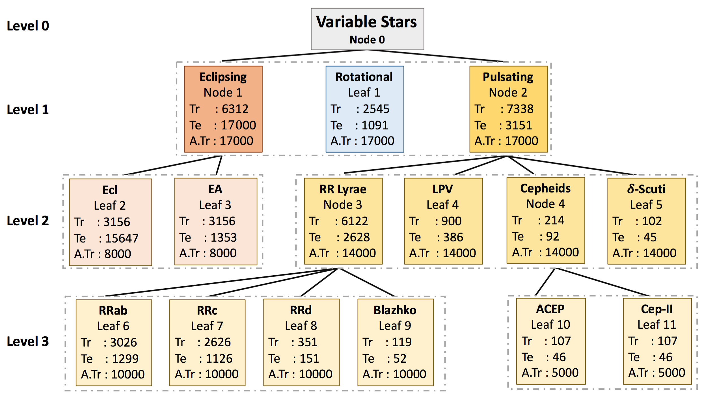
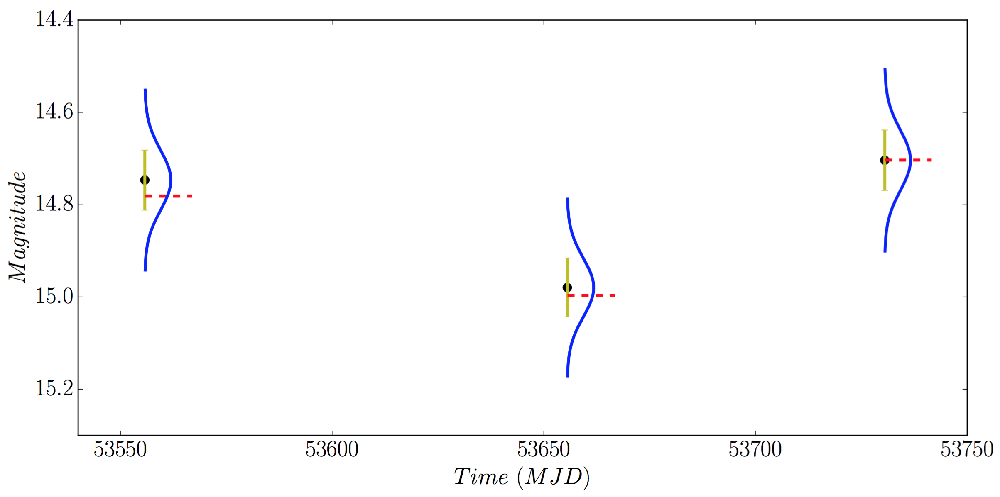
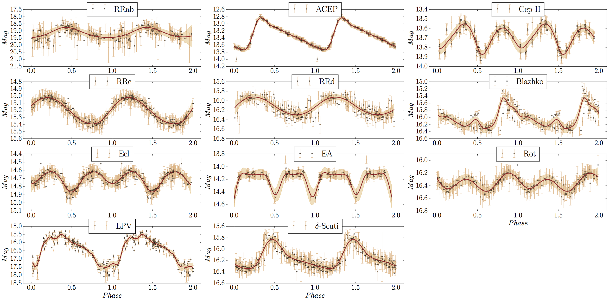
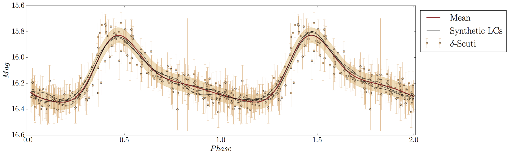

# Imbalance Learning for Variable Star Classification using Machine Learning

Artificially creating new light curves for variable stars using three different techniques: SMOTE, RASLE and GpFit. Afterward, applying these data augmentation techniques to construct a 'data-level' approach in a Hierachical Taxonomy to classify variable stars using Machine Learning.

*Reference Paper:* [Hosenie et al. 2020, MNRAS](https://doi.org/10.1093/mnras/staa642) or on [arXiv: Imbalance Learning for Variable Star Classification](https://arxiv.org/abs/2002.12386)

*Corresponding Authors:* 
[Zafiirah Hosenie](https://www.linkedin.com/in/zafiirah-hosenie/), Robert Lyon, Benjamin Stappers, Arrykrishna Mootoovaloo and Vanessa McBride.

## Description:

Data-Level Hierarchical Classification framework is a machine learning method for efficiently augmenting light curves at different level in a hierarchical way and perform classification of periodic variable stars using [The Catalina Surveys Southern Periodic Variable Catalog](http://nesssi.cacr.caltech.edu/DataRelease/VarcatS.html).



Usage:
---
To reproduce the plots in the paper, run all the notebooks with name 'Plots - ...'.

```
./notebook/
```
1(a). First method of augmentation: SMOTE. We need to extract features. To do so, run the following code:

```
cd notebook/
Open Jupyter notebook using Python 2.7 and run this script: a.Step 1 - Feature Extraction.ipynb
```
1(b). Perform hierarchical classification using the extracted features and automatically augment the training set using SMOTE technique.
```
cd notebook/
Open Jupyter notebook using Python >= 3.5 and run this script: a.Step 2 - Hierarchical_classfication_with_SMOTE.ipynb
```
2(a). Second method of augmentation: RASLE - Randomly sample light curves from magnitude errors. We first augment the light curves and extract features from both the real and augmented light curves.

```
cd notebook/
Open Jupyter notebook using Python >= 2.7 and run this script: b.Step 1 - Data Augmentation with RASLE and Feature Extraction.ipynb
```

2(b). Perform hierarchical classification using extracted features from RASLE method of dataaugmentation
```
cd notebook/
Open Jupyter notebook using Python >= 3.5 and run this script: b.Step 2 - Hierarchical_classfication_with_RASLE.ipynb
```

3(a). Third Method of augmentation using Gaussian Process: GpFit. We first transform the light curve from time-domain to phase domain and apply GP on the LCs. We then randomly sample light curves from the posterior distribution. We then convert back the augmented LCs from phase domain to time-domain and then extract features from both the augmented and real LCs.
```
cd notebook/
Open Jupyter notebook using Python >= 2.7 and run this script: c.Step 1 - Data Augmentation with GpFit and Feature Extraction.ipynb
```



3(b). Perform hierarchical classification using extracted features from GpFit method of dataaugmentation
```
cd notebook/
Open Jupyter notebook using Python >= 3.5 and run this script: c.Step 2 - Hierarchical_classfication_with_GpFit.ipynb
```


